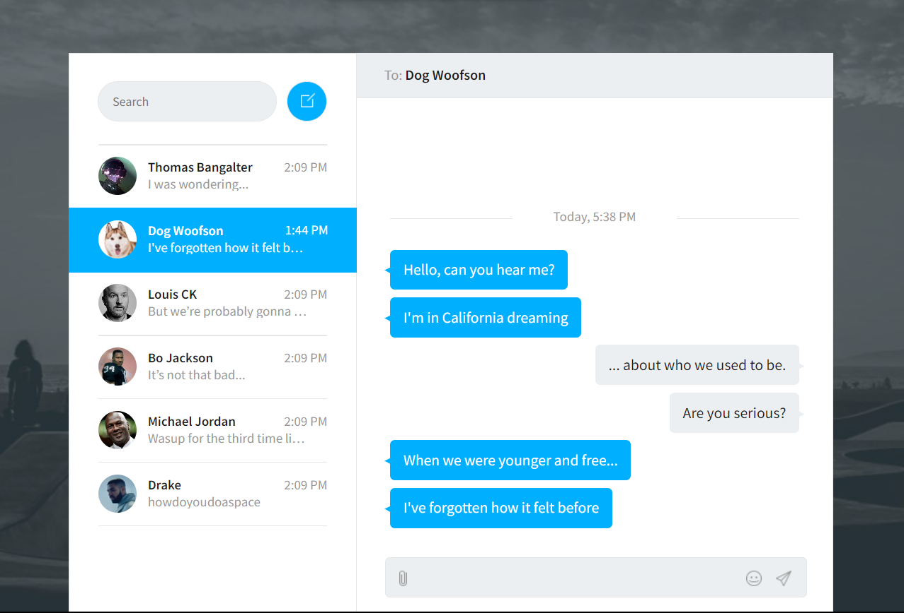

A pen created on Vinishireis
---
Chat Web | Vinishireis
---
Este projeto é um sistema de chat baseado na web, desenvolvido para permitir a comunicação em tempo real entre usuários conectados à mesma plataforma. Aqui está uma visão geral do projeto e como você pode começar a usá-lo.

Funcionalidades Principais
Registro e Login: Os usuários podem se registrar e fazer login para acessar o sistema de chat.
Salas de Chat: Os usuários podem criar e participar de salas de chat para conversas em grupo.
Mensagens em Tempo Real: As mensagens são entregues em tempo real, proporcionando uma experiência de chat fluida.
Notificações: Os usuários recebem notificações instantâneas sobre novas mensagens e atividades relevantes.
Perfis de Usuário: Os usuários podem personalizar seus perfis com fotos, informações pessoais e preferências de chat.

Tecnologias Utilizadas
Frontend: HTML, CSS, JavaScript 
Autenticação: JSON Web Tokens (JWT) para autenticação de usuários
Notificações: WebSockets para enviar notificações em tempo real aos usuários

